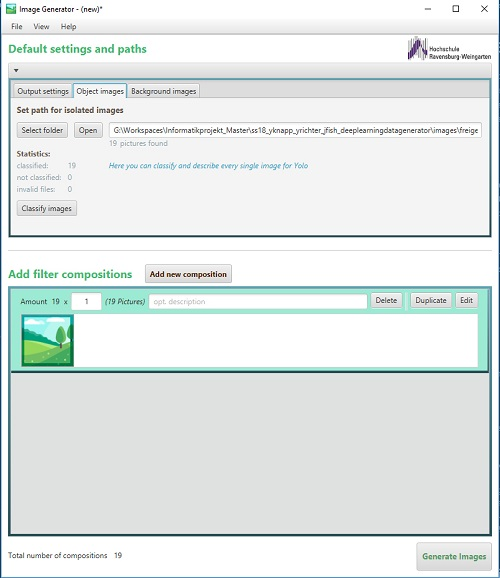
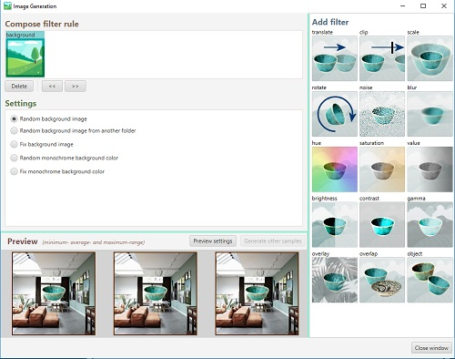
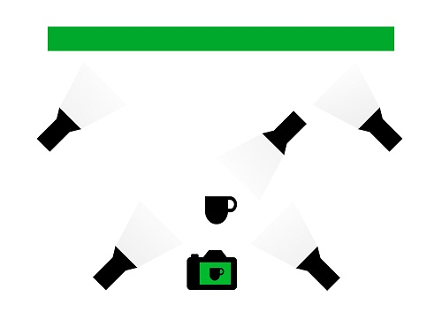
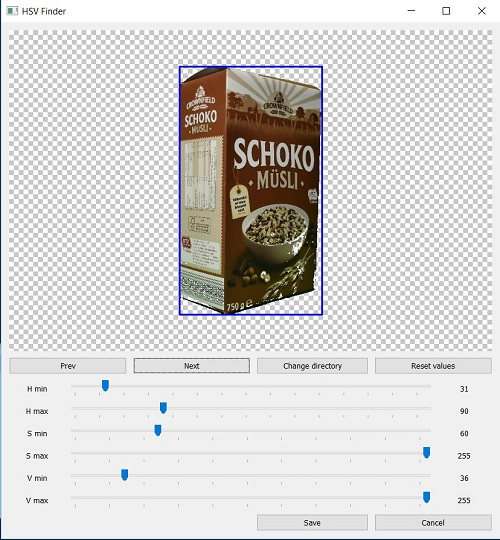

# Automated generation of training data for YOLO

YOLO needs big amounts of test images to learn new object classes. This is very time-consuming and takes up the most time of the whole YOLO learning process. That's why the **YOLO-Train-Data-Generator** was built. It helps creating this data with minimal effort. By combining object images with backgrounds and additionally manipulating these by affine transformations and several filters you can artificially increase a few images to a large pile of images.

This work was carried out as part of the scientific project for the master degree in the university [Hochschule Weingarten](http://www.rwu.de).


## How it works

As input the YOLO-Train-Data-Generator needs images of objects. These must be either already cropped objects on a transparent background or objects in front of a green screen. Furthermore background images are needed - the more, the better.<br />
Over the graphical user interface you can take all necessary actions. Here you can select the object, background and output directories and the desired image resolution. To tell the program to which class an object belongs, you can assign each object to an object class. When all preparations are completed, you can add up to 15 manipulations over the filter window:


1. **Affine transformations:**
  - translate object
  - clip object (place object partially outside the frame)
  - scale object
  - rotate object


2. **Image processing filters:**
  - add noise
  - add blur
  - change hue
  - change saturation
  - change value
  - change brightness
  - change contrast
  - change gamma
  - add overlay


3. **Add additional objects:**
  - add multiple objects behind object
  - add object behind or in front of object (overlap)

By clicking *'Generate Images'* the program starts generating images. For every image a YOLO specific text file is also created containing the object's class and its exact location in the image. Additionally another four YOLO specific files are created, which contain more detailed information about the objects and the YOLO settings:

- **train.txt**: contains a list of all file names of the created images. This file will tell YOLO where to find its train images
- **obj.data**: contains the number of object classes of the generated images
- **obj.names**: contains assignment of class names to class IDs
- **yolo-obj.cfg**: contains a lot of information on how YOLO will train and detect the given objects

Screenshots:





## How to use

### Graphical user interface
Start the Java application by opening the file **ImgGeneration.jar**. Over the graphical interface you can take all your desired setups as described in the previous paragraph. By clicking *'Generate Images'* the Java application triggers the Python script taking care of generating the images.<br />

### Use Python script
Alternatively you can directly invoke the Python script. But this only works, if you previously configurated your settings with the GUI and so the file 'data.xml' is created. Then you can invoke the Python script with the following command:
```console
python main.py data.xml
```

Following options are also available:
- <i>-yv</i> or <i>--yolo_version</i> to select YOLO version (2 or 3)
- <i>-b</i> or <i>--bounding_boxes</i> to draw bounding boxes into the output images (for debugging)
- <i>-ny</i> or <i>--no_yolo_output</i> so only images are created without YOLO specific files


## Create object images

### Take photographs in front of green screen
For a good and reliable result, the lighting of the scene is very important. For this purpose we recommend a 5 point lighting setup. This setup ensures that reflections from the green canvas onto the object are minimized. To avoid strong shadow edges the object is illuminated by both right and left and the top. For further improvement softboxes are attached on all lights. By also directing two spotlights on the green canvas you can avoid shadows e.g. resulting of folds.



### Find best HSV values with HSV-Finder
To separate an object from the green screen background, the object image has to be converted from RGB to the HSV color space. By setting certain ranges of hue, saturation and value, all greens pixels in the image can be masked and cut away. However, these areas strongly depend on the photographs. In order to obtain an optimal masking you can use this program. It shows the direct effects of set HSV areas and the resulting bounding box around the object in real time. The values set here will be used later automatically when generating training data. The program is also a helpful tool to get the optimal lighting setup while photographing an object in front of green screen.



## Dependencies
The following packages are crucial for the YOLO-Train-Data-Generator:
- Python (>= 3.5.2)
- OpenCV (>= 3.3.0)
- Numpy (>= 1.15.4)
- PyQt5 (>= 5.11.3)
- Java Development Kit
- JavaFX

## Paper
The paper for this work can be found in this repository.

## Authors
* **Yannick Knapp** (Yannick.Knapp@hs-weingarten.de)
* **Yannick Richter** (Yannick.Richter@hs-weingarten.de)
* **Jonathan Fish** (Jonathan.Fish@hs-weingarten.de)
